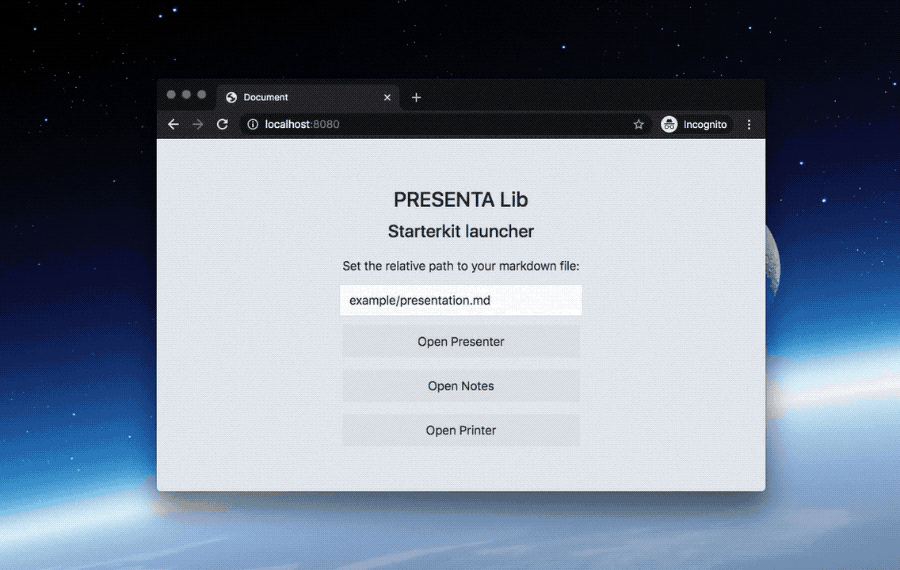

# PRESENTA Lib Starterkit

Create a local [PRESENTA Lib](https://lib.presenta.cc/) based presentation using **markdown**. 

### 👉 **This starterkit needs to be run within a local webserver.** 👈

Download the bundle [here](https://github.com/presenta-software/presenta-lib-starterkit/archive/master.zip) then:

- 📦 unzip it
- 🖥 fire a local web-server in it (you can use this [Chrome extension](https://chrome.google.com/webstore/detail/web-server-for-chrome/ofhbbkphhbklhfoeikjpcbhemlocgigb))
- ✍️ edit `example/presentation.md` with your favourite markdown editor
- 🗳 save & refresh the browser
- 🎉 enjoy

To have a glimpse, check the [online playground](https://play.presenta.cc).

This starterkit includes the latest releases of:

- [PRESENTA Lib](https://github.com/presenta-software/presenta-lib)
- [MD2PJSON](https://github.com/presenta-software/md2pjson)
- [Youtube Block](https://github.com/presenta-software/presenta-block-youtube)
- [Chartjs Block](https://github.com/presenta-software/presenta-block-chartjs)
- [Flowchart.js Block](https://github.com/presenta-software/presenta-block-flowchartjs)
- [Fitty Block](https://github.com/presenta-software/presenta-block-fitty)
- [ModelViewer Block](https://github.com/presenta-software/presenta-block-modelviewer)
- [Vegalite Block](https://github.com/presenta-software/presenta-block-vegalite)
- [ModelViewer Block](https://github.com/presenta-software/presenta-block-modelviewer)
- [HighLightJs Module](https://github.com/presenta-software/presenta-module-highlightjs)
- [Styles Controller](https://github.com/presenta-software/presenta-controller-styles)
- [Markdown Controller](https://github.com/presenta-software/presenta-controller-markdown)
- [Swiper Controller](https://github.com/presenta-software/presenta-controller-swiper)
- [ConsoleNotes Controller](https://github.com/presenta-software/presenta-controller-console-notes)

## Licence

**PRESENTA Lib** and its plugins are released under the [3-Clause BSD license](LICENSE).

Copyright © 2020-21 Fabio Franchino, [https://fabiofranchino.com](https://fabiofranchino.com)